# Homework 1
首先先視覺化 Data，暫時不切 train test，分成 category 跟 numerical，區分出來之後在重新確認每個 col 的 type。

```python
import pandas as pd
import matplotlib.pyplot as plt
from sklearn.preprocessing import StandardScaler
import seaborn as sns

df = pd.read_csv("data/raw/UCI_Credit_Card.csv")
df = df.drop(columns=["ID", "default.payment.next.month"])  # Drop target column

# Category columns
pay_status_cols = [
    col for col in df.columns if col.startswith("PAY_") and not col.startswith("PAY_AMT")
]
cat_cols = ["SEX", "EDUCATION", "MARRIAGE"]
cat_cols.extend(pay_status_cols)

print(f"Category columns: {cat_cols}")

# Numerical columns
num_cols = [col for col in df.columns if col not in cat_cols]

# Double check if all columns' types are correct
df[num_cols] = df[num_cols].astype("float64")
df[cat_cols] = df[cat_cols].astype("category")
```

視覺化，category 使用 bar chart，數值因為都是連續數值，使用 histogram 繪製

```python
# Visualize categorical columns
for col in cat_cols:
    df[col].value_counts().sort_index().to_frame().plot(kind="bar")
    plt.savefig(f"outputs/images/{col}_countplot.png")
```

```python
# Visualize numerical columns
for col in num_cols:  # 選三個關鍵變數
    plt.figure(figsize=(12, 6))
    sns.histplot(df[col], bins=50, kde=True)
    plt.title(col)
    plt.savefig(f"outputs/images/{col}_histplot.png")
    plt.close()
```

數值使用 Standard Scaler 而非 MinMax 是因為有些欄位的離群值滿大的，使用 SS 比較不會被這些離群值影響。考慮將連續值離散化，但後面搭配建模應該會比較容易知道要怎麼切比較好。

```python
# Standardize numerical columns
ss = StandardScaler()
df[num_cols] = ss.fit_transform(df[num_cols])
```

單純使用 dummy variable，之後建模的時候可以搭配其它的 col 組合成新的 feature（例如兩個 col 相乘）。Drop first 是要避免共線性（回歸類的建模）。

```python
# Transform categorical into dummies columns
# For later use in the model
df_cat_dummies = pd.get_dummies(df, columns=cat_cols, drop_first=True)
```

# Category Visualization
|||
|---|---|
| 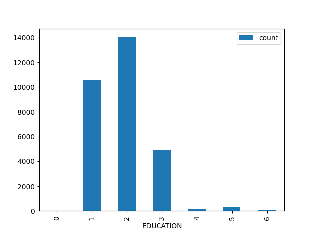 | 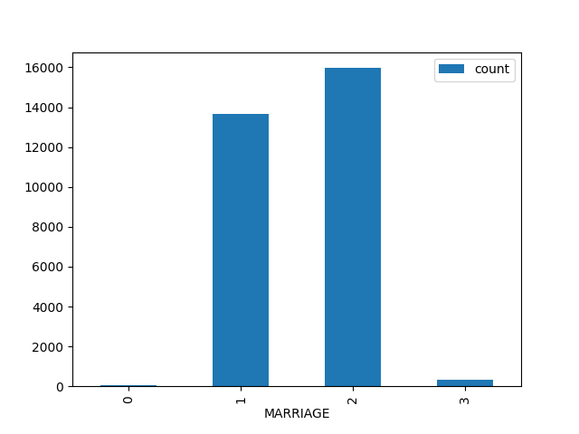 |
| 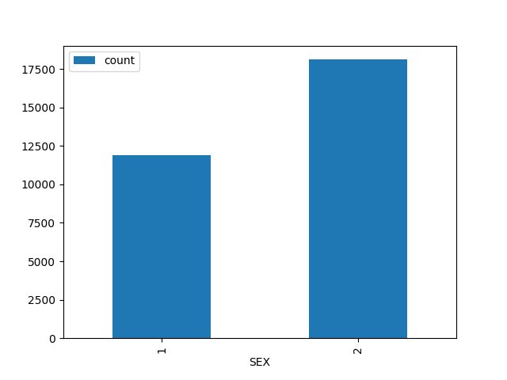 | 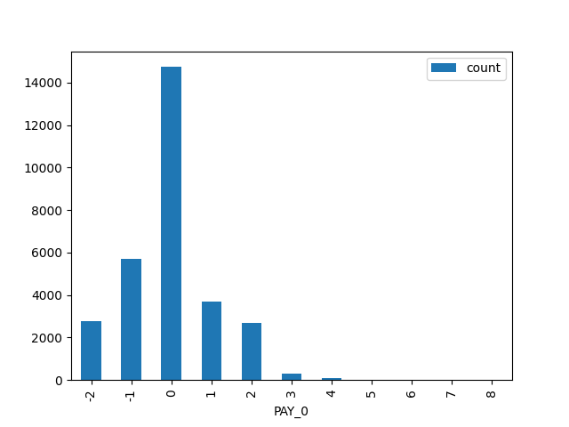 |
| 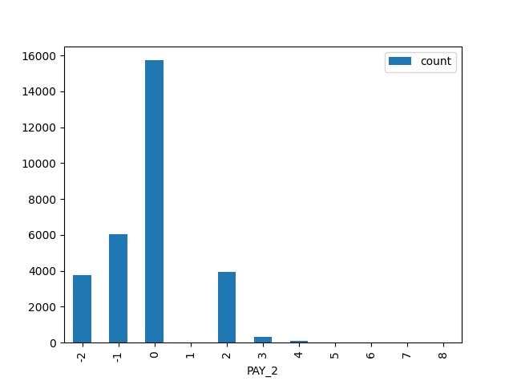 | 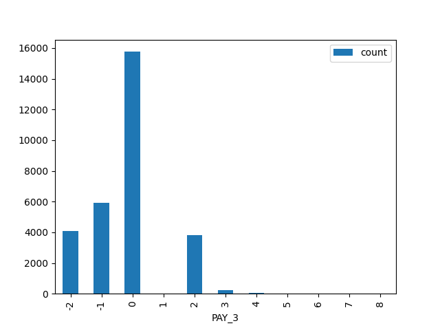 |
|  | 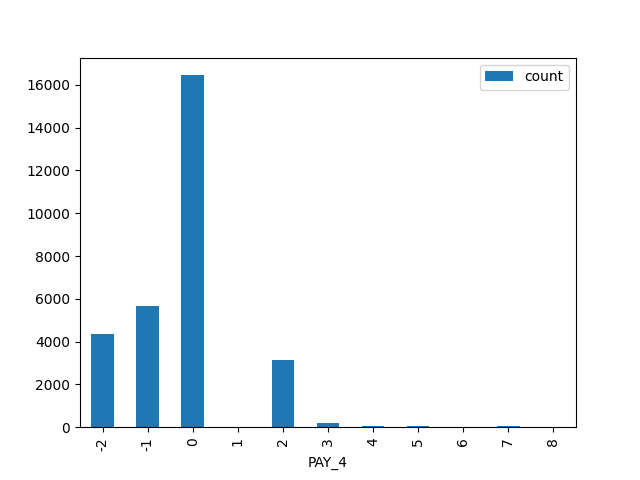 |
| 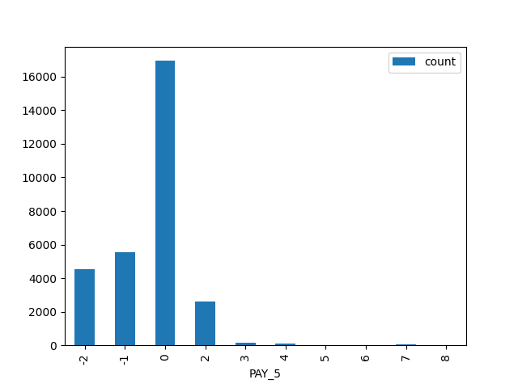 | 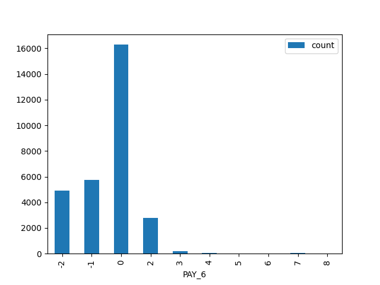 |

# Numerical Visualization

|||
|---|---|
| 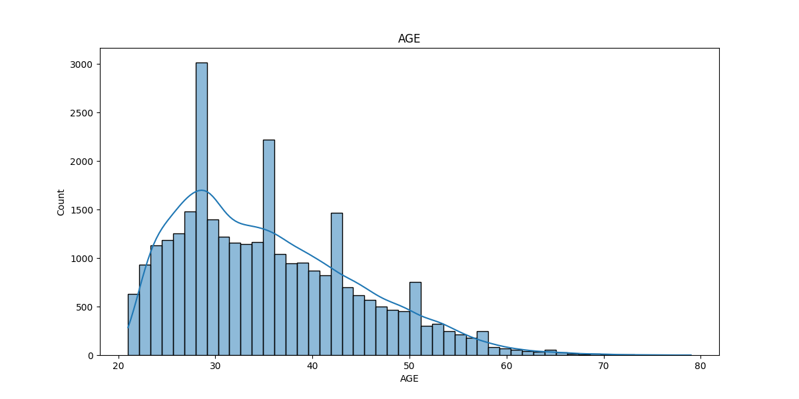 | 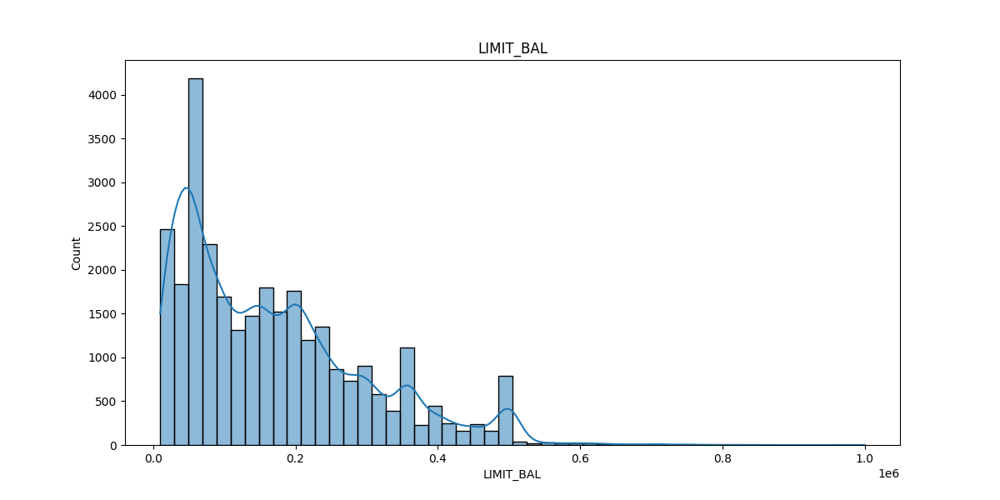 |
| 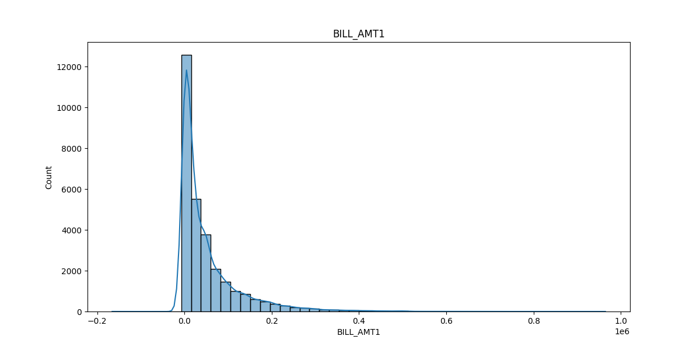 | 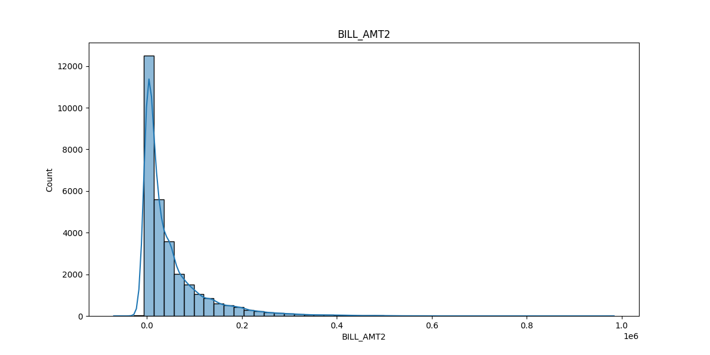 |
| 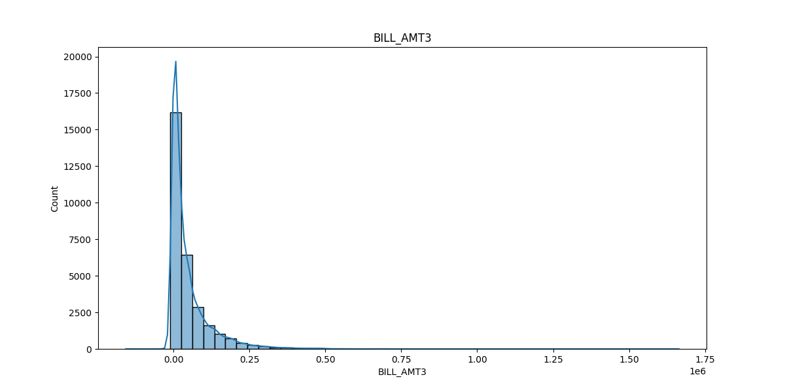 | 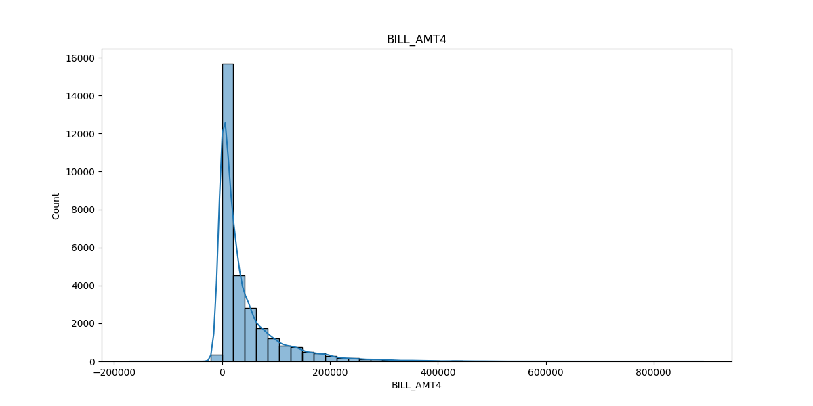 |
| 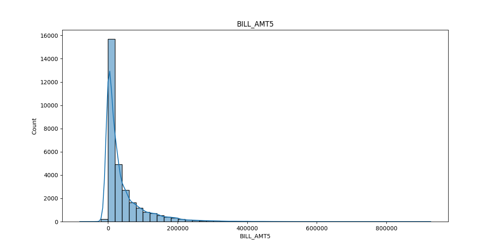 | 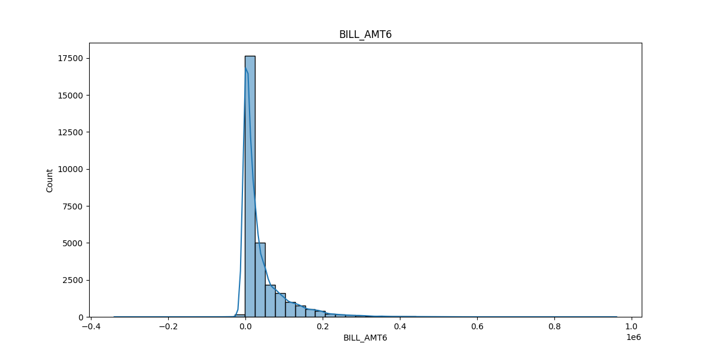 |
| 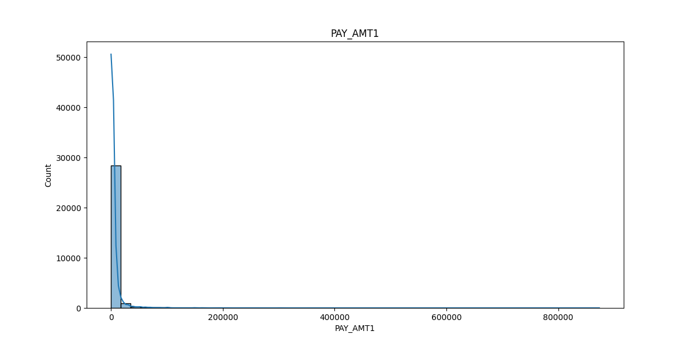 | 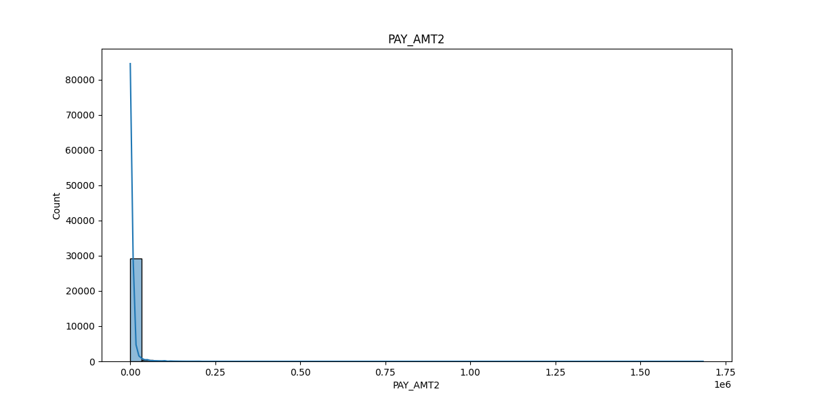 |
| 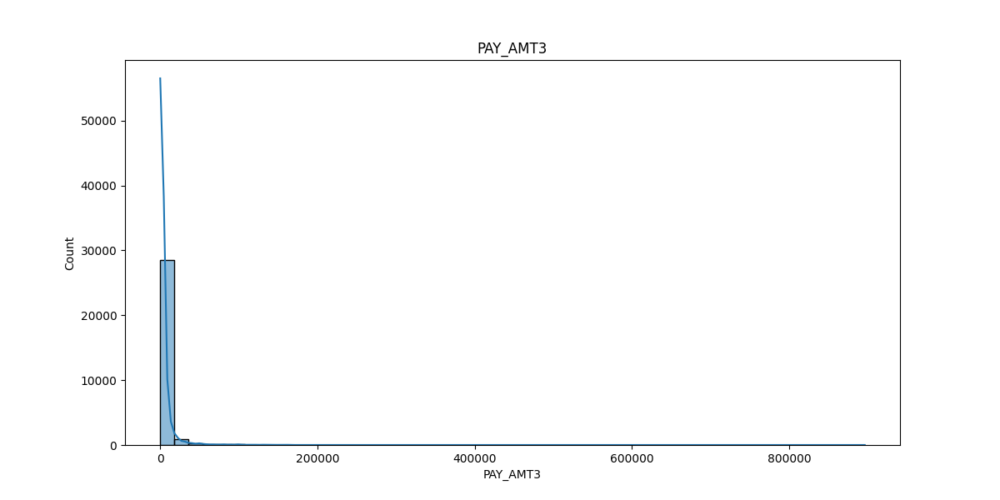 | 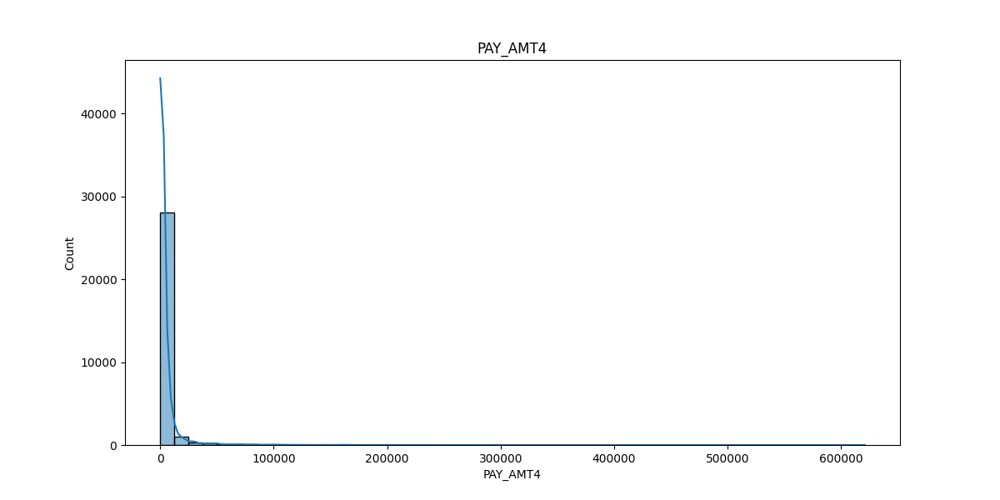 |
| 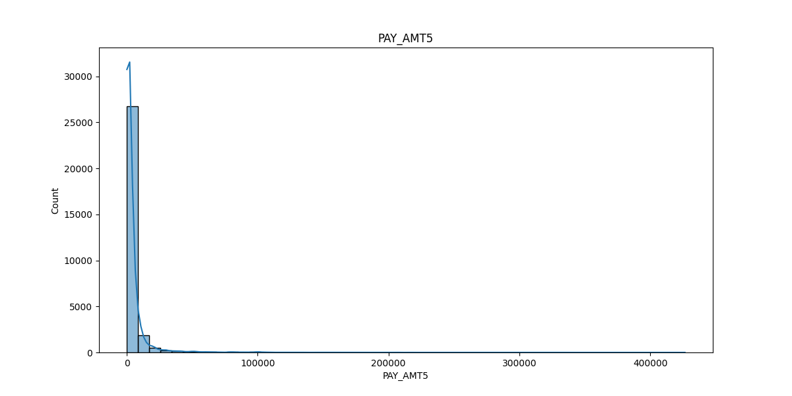 | 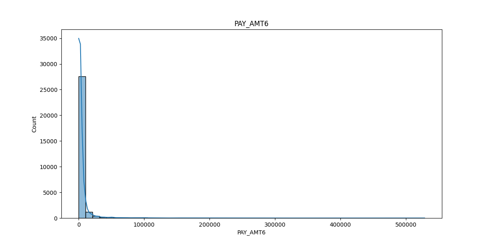 |

<!-- Category columns: ['SEX', 'EDUCATION', 'MARRIAGE', 'PAY_0', 'PAY_2', 'PAY_3', 'PAY_4', 'PAY_5', 'PAY_6']
Numerical columns: ['LIMIT_BAL', 'AGE', 'BILL_AMT1', 'BILL_AMT2', 'BILL_AMT3', 'BILL_AMT4', 'BILL_AMT5', 'BILL_AMT6', 'PAY_AMT1', 'PAY_AMT2', 'PAY_AMT3', 'PAY_AMT4', 'PAY_AMT5', 'PAY_AMT6'] -->