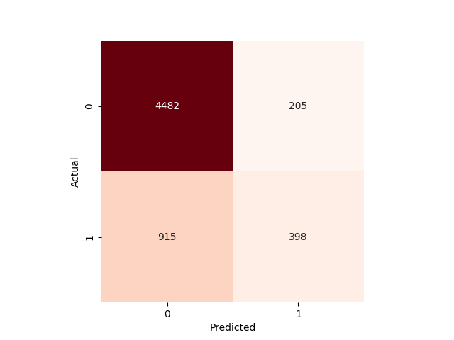

# Homework 2

> 資料集切成 train test 8:2  
> 這次只使用 LogisticRegression 來做訓練，分別使用不同欄位的資料（不做任何改動、只放入過去曾經 delay 付款的欄位、delay 付款的虛擬變數欄位結合其它數值欄位產生新的欄位）

## Train 1

> 第一個訓練測試，
直接把上次使用 SS 正歸化以及產生虛擬變數的資料餵入模型，不做其它調整

`train_1.py`
```python
import pandas as pd
from sklearn.metrics import accuracy_score, f1_score, recall_score, precision_score


def load_data():
    train_x = pd.read_csv("data/processed/train_x.csv")
    train_y = pd.read_csv("data/processed/train_y.csv")
    test_x = pd.read_csv("data/processed/test_x.csv")
    test_y = pd.read_csv("data/processed/test_y.csv")
    return train_x, train_y, test_x, test_y


def evaluate(y_true, y_pred):
    accuracy = accuracy_score(y_true, y_pred)
    f1 = f1_score(y_true, y_pred)
    recall = recall_score(y_true, y_pred)
    precision = precision_score(y_true, y_pred)
    return accuracy, f1, recall, precision


if __name__ == "__main__":
    from sklearn.linear_model import LogisticRegression
    from dvclive import Live

    train_x, train_y, test_x, test_y = load_data()

    y_col = "default.payment.next.month"
    x_cols = train_x.columns

    # Train model
    with Live(dir="dvc/train") as live:
        model = LogisticRegression()
        model.fit(train_x, train_y)

    # Test model
    with Live(dir="dvc/test") as live:
        y_pred = model.predict(test_x)
        accuracy, f1, recall, precision = evaluate(test_y, y_pred)

        live.log_metric("accuracy", accuracy)
        live.log_metric("f1", f1)
        live.log_metric("recall", recall)
        live.log_metric("precision", precision)
```

### Output

```python
{
    "accuracy": 0.8186666666666667,
    "f1": 0.45490981963927857,
    "recall": 0.3457730388423458,
    "precision": 0.664714494875549
}
```


## Train 2
> 去蕪存菁，只保留有 delay 的欄位，其它的欄位都不使用

`train_2.py`
```python
# Train model with delay info
with Live(dir="dvc/train-delay-only") as live:
    model = LogisticRegression()
    model.fit(train_x[dummy_cols_pay_delay], train_y)

# Test model with delay info
with Live(dir="dvc/test-delay-only") as live:
    y_pred = model.predict(test_x[dummy_cols_pay_delay])
    accuracy, f1, recall, precision = evaluate(test_y, y_pred)

    live.log_metric("accuracy", accuracy)
    live.log_metric("f1", f1)
    live.log_metric("recall", recall)
    live.log_metric("precision", precision)

    # Generate confusion matrix
    cm = confusion_matrix(y_true=test_y, y_pred=y_pred)
    fig = plt.figure()
    sns.heatmap(cm, annot=True, fmt="d", cmap="Reds", cbar=False, square=True)
    plt.xlabel("Predicted")
    plt.ylabel("Actual")
    live.log_image("confusion_matrix.png", fig)
```

### Output

```python
{
    "accuracy": 0.8205,
    "f1": 0.4590657960823707,
    "recall": 0.3480578827113481,
    "precision": 0.6740412979351033
}
```


## Train 3

> 第三個訓練測試，
使用 delay 的 dummy variable 結合其它數值欄位，產生新的欄位，使用新產出的欄位 + 其它非數值欄位來做訓練

`train_2.py`

```python
# Train model with dummy variables * num cols (create new dataset)
dummy_train_x = pd.concat(
    [
        train_x[x_num_cols].mul(train_x[d_col], axis=0).add_prefix(f"{d_col}_")
        for d_col in dummy_cols_pay_delay
    ],
    axis=1,
)

dummy_test_x = pd.concat(
    [
        test_x[x_num_cols].mul(test_x[d_col], axis=0).add_prefix(f"{d_col}_")
        for d_col in dummy_cols_pay_delay
    ],
    axis=1,
)

# Concatenate with other dummy variables
dummy_train_x = pd.concat([dummy_train_x, train_x[dummy_cols_others]], axis=1)
dummy_test_x = pd.concat([dummy_test_x, test_x[dummy_cols_others]], axis=1)

with Live(dir="dvc/train-delay-num") as live:
    model = LogisticRegression()
    model.fit(dummy_train_x, train_y)

# Test model with dummy variables * num cols
with Live(dir="dvc/test-delay-num") as live:
    y_pred = model.predict(dummy_test_x)
    accuracy, f1, recall, precision = evaluate(test_y, y_pred)

    live.log_metric("accuracy", accuracy)
    live.log_metric("f1", f1)
    live.log_metric("recall", recall)
    live.log_metric("precision", precision)

    # Generate confusion matrix
    cm = confusion_matrix(y_true=test_y, y_pred=y_pred)
    fig = plt.figure()
    sns.heatmap(cm, annot=True, fmt="d", cmap="Reds", cbar=False, square=True)
    plt.xlabel("Predicted")
    plt.ylabel("Actual")
    live.log_image("confusion_matrix.png", fig)
```

### Output

```python
{
    "accuracy": 0.8133333333333334,
    "f1": 0.4154488517745303,
    "recall": 0.3031226199543031,
    "precision": 0.6600331674958541
}
```



## Conclusion

為什麼做這三個實驗？

- Train 1：建立 baseline，使用全部特徵
- Train 2：驗證 delay 欄位是否最關鍵
- Train 3：嘗試用交互特徵提升表現

結果比較
- Train 2：最好，delay 欄位最有預測力
- Train 3：沒有明顯幫助
- Train 1：沒有明顯差別，但是少了很多處理時間